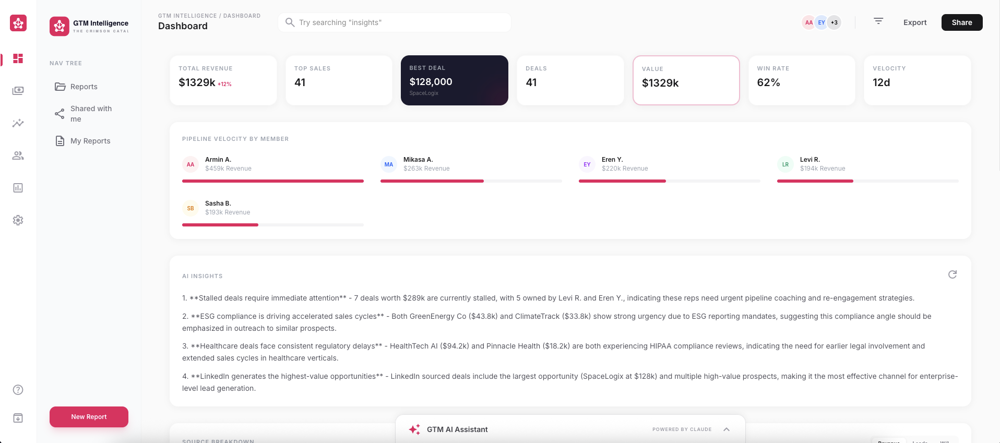

<div align="center">

<a href="https://frontend-seven-ecru-39.vercel.app" target="_blank"></a>

# GTM Intelligence

### The AI-Powered CRM Dashboard for B2B Sales Teams

**Ask questions about your pipeline in plain English. Get answers backed by real data.**

[](https://react.dev)
[](https://fastapi.tiangolo.com)
[](https://anthropic.com)
[](https://pinecone.io)
[](https://tailwindcss.com)

</div>

---

<div align="center">
<a href="https://frontend-seven-ecru-39.vercel.app" target="_blank"></a>
<br />
<sub>Live dashboard with KPI cards, pipeline velocity, AI insights, and chat assistant</sub>
</div>

---

## What is GTM Intelligence?

GTM Intelligence turns your CRM data into a conversational AI experience. Instead of digging through spreadsheets and filters, your sales team simply **asks questions** and gets instant, accurate answers powered by RAG (Retrieval-Augmented Generation).

**The problem:** Sales managers waste hours manually slicing pipeline data to find stalled deals, compare rep performance, or prep for weekly reviews.

**The solution:** Upload your CRM data once. Ask anything. The AI retrieves the relevant records from a vector database and generates answers grounded in your actual data — no hallucinations.

---

## Key Features

### AI Chat Assistant
A conversational interface accessible from every page. Ask natural language questions like:
- *"Which leads haven't been contacted in 30 days?"*
- *"Who is our top performer this month?"*
- *"Summarize the pipeline from Dribbble leads"*
- *"What is the total value of stalled deals?"*

The assistant automatically detects broad vs. specific queries and adjusts how much data it retrieves to give accurate answers.

### 6-Page Dashboard Suite
A full multi-page application with persistent navigation:

| Page | What It Shows |
|------|---------------|
| **Dashboard** | KPI cards, pipeline velocity by rep, source breakdown, deals chart, AI insights |
| **Deals** | Sortable, filterable CRM data table with all pipeline records |
| **Intelligence** | Full-page AI chat for deep pipeline analysis |
| **Network** | Team performance cards with per-rep metrics |
| **Reports** | AI-generated pipeline reports with export/share |
| **Settings** | CSV upload, Google Sheets sync, automation controls |

### Daily Automation System
Fully automated morning reports — zero manual work:
- **Email Reports** — AI-generated HTML pipeline report delivered to your inbox every morning at 9 AM
- **Slack Alerts** — Stalled deal notifications posted to your Slack channel automatically
- **Manual Trigger** — Run the full automation cycle on-demand from the Settings page
- **Scheduler** — Background daemon thread with configurable schedule

### One-Click AI Reports
Generate a full markdown pipeline report with Executive Summary, Top Deals, Risk Areas, and Recommendations — all written by Claude from your live data. Export or share reports directly from the Reports page.

### AI-Generated Insights
The dashboard automatically analyzes your full pipeline and surfaces 4 actionable insights without you asking a specific question.

### Google Sheets Sync
Connect a Google Sheet as your CRM source. New records sync into the vector database automatically.

### Dynamic Navigation Tree
Collapsible sidebar with quick access to Reports, Shared items, and My Reports — persistent across all pages.

---

## Architecture

```
┌─────────────────────────────────────────────────────────┐
│                    React Frontend                       │
│      Tailwind CSS  ·  Recharts  ·  Vite  ·  6 Pages    │
└──────────────────────┬──────────────────────────────────┘
                       │ REST API (12 endpoints)
┌──────────────────────▼──────────────────────────────────┐
│                  FastAPI Backend                         │
│                                                         │
│  POST /chat ──────► Pinecone Query ──► Claude RAG       │
│  POST /upload ────► CSV Parse ──► Cohere Embed ──► Upsert│
│  POST /sync ──────► Google Sheets ──► Embed ──► Upsert  │
│  GET  /insights ──► Full Pipeline ──► Claude Analysis    │
│  GET  /report ────► Full Pipeline ──► Claude Report      │
│  GET  /leads ─────► All CRM Records                     │
│  GET  /team ──────► Team Stats by Rep                   │
│  GET  /stats ─────► Aggregated Pipeline Stats           │
│  POST /automation/trigger ──► Run Daily Cycle Now       │
│  GET  /automation/status ──► Scheduler Status           │
│  GET  /health                                           │
└────────┬──────────┬──────────┬─────────────────────────┘
         │          │          │
    ┌────▼────┐ ┌───▼────┐ ┌──▼──────────┐
    │Pinecone │ │ Claude │ │  Scheduler  │
    │(Vectors)│ │  API   │ │  (Daemon)   │
    └─────────┘ └────────┘ └──┬──────┬───┘
         ▲                    │      │
    ┌────┴────┐         ┌────▼──┐ ┌─▼────┐
    │ Cohere  │         │ Gmail │ │Slack │
    │(Embeds) │         │ SMTP  │ │Hooks │
    └─────────┘         └───────┘ └──────┘
```

### How RAG Works Here

1. **Upload** — CRM records (CSV or Google Sheet) are converted to text, embedded via Cohere (`embed-english-v3.0`, 1024 dimensions), and stored in Pinecone.
2. **Query** — When a user asks a question, the query is embedded and Pinecone returns the most semantically similar records.
3. **Generate** — The retrieved records are passed as context to Claude, which answers based on actual data — not training knowledge.

---

## Tech Stack

| Layer | Technology | Why |
|-------|-----------|-----|
| **Frontend** | React 19 + Tailwind CSS 4 | Component-based UI with utility-first styling |
| **Backend** | Python FastAPI | Async-first, fast, auto-generated API docs |
| **AI Model** | Claude Sonnet 4 | Best-in-class reasoning for data analysis |
| **Vector DB** | Pinecone | Managed vector search, free tier available |
| **Embeddings** | Cohere `embed-english-v3.0` | Free tier, 1024 dimensions, high quality |
| **Email** | Resend API | Automated HTML report delivery |
| **Alerts** | Slack Incoming Webhooks | Stalled deal notifications |
| **Scheduler** | Python `schedule` | Background daemon for daily automation |
| **Sheets Sync** | gspread + Google Auth | Direct Google Sheets integration |
| **Deployment** | Vercel (frontend) + Railway (backend) | Production-ready hosting |

---

## Quick Start

### Prerequisites

- Node.js 18+
- Python 3.10+
- API keys: [Anthropic](https://console.anthropic.com), [Pinecone](https://pinecone.io), [Cohere](https://cohere.com)

### 1. Clone & Install

```bash
git clone https://github.com/KyriakosOuz/GTM-Intelligence.git
cd GTM-Intelligence

# Frontend
cd frontend && npm install && cd ..

# Backend
cd backend && pip install -r requirements.txt && cd ..
```

### 2. Configure Environment

```bash
# backend/.env
ANTHROPIC_API_KEY=sk-ant-...
PINECONE_API_KEY=pcsk_...
PINECONE_INDEX_NAME=gtm-intelligence
COHERE_API_KEY=...
GMAIL_ADDRESS=your@gmail.com
GMAIL_APP_PASSWORD=...
REPORT_EMAIL_TO=recipient@example.com
SLACK_WEBHOOK_URL=https://hooks.slack.com/services/...
REPORT_HOUR=9
REPORT_MINUTE=0
```

```bash
# frontend/.env
VITE_API_URL=http://localhost:8000
```

> **Pinecone Index:** Create an index named `gtm-intelligence` with **1024 dimensions** and **cosine** metric.

### 3. Load Demo Data

```bash
# Start backend first
cd backend && uvicorn main:app --port 8000

# Upload the demo CSV (in another terminal)
curl -X POST http://localhost:8000/upload \
  -F "file=@data/demo_crm.csv"
```

### 4. Run

```bash
# Terminal 1 — Backend
cd backend && uvicorn main:app --reload --port 8000

# Terminal 2 — Frontend
cd frontend && npm run dev
```

Open **http://localhost:5173** and start asking questions.

---

## API Reference

| Method | Endpoint | Description |
|--------|----------|-------------|
| `GET` | `/health` | Health check |
| `POST` | `/chat` | Send a question, get a RAG-powered answer |
| `POST` | `/upload` | Upload CSV, embed records into Pinecone |
| `POST` | `/sync` | Sync Google Sheet into Pinecone |
| `GET` | `/sync/status` | Last sync timestamp |
| `GET` | `/insights` | 4 AI-generated pipeline insights |
| `GET` | `/report` | Full AI-written pipeline report (markdown) |
| `GET` | `/leads` | All CRM records from Pinecone |
| `GET` | `/team` | Team performance stats by rep |
| `GET` | `/stats` | Aggregated pipeline statistics |
| `POST` | `/automation/trigger` | Manually run the daily automation cycle |
| `GET` | `/automation/status` | Scheduler status and next scheduled run |

All endpoints return: `{ "success": bool, "data": any, "error": string | null }`

---

## Project Structure

```
GTM-Intelligence/
├── frontend/
│   ├── src/
│   │   ├── components/     # Dashboard components
│   │   ├── pages/          # Dashboard, Deals, Intelligence,
│   │   │                   # Network, Reports, Settings
│   │   ├── hooks/          # useChat.js — chat state management
│   │   ├── services/       # api.js — all API calls
│   │   └── App.jsx         # Router + layout
│   └── .env
├── backend/
│   ├── main.py             # FastAPI entry + CORS + scheduler
│   ├── scheduler.py        # Daily automation scheduler
│   ├── routers/            # chat, upload, sync, insights, report,
│   │                       # leads, team, stats, automation
│   ├── services/           # pinecone, claude, sheets, email, slack
│   └── .env
└── data/
    ├── demo_crm.csv        # 26 realistic B2B records
    └── test_*.csv           # Industry-specific test datasets
```

---

## Demo Data

The app ships with 26 realistic B2B CRM records for demo purposes:

- **Pipeline value:** $528,976.82
- **Top deal:** $42,300 (Rolf Inc.)
- **Sales reps:** Armin A., Eren Y., Mikasa A., Levi R., Sasha B.
- **Statuses:** Active, Stalled, Closed Won, Closed Lost, New
- **Sources:** Dribbble, Instagram, Behance, Google, LinkedIn
- **Industries:** SaaS, Logistics, Healthcare, EdTech, Cloud Services, and more

---

## Design System — The Crimson Catalyst

| Token | Value |
|-------|-------|
| Primary Accent | `#E8175D` |
| Background | `#FAFAFA` |
| Card Surface | `#FFFFFF` |
| Dark Card | `#1A1A2E` |
| Headlines | Manrope 700 |
| Body | Inter 400 |
| Border Radius | 16px |

The UI was designed in Google Stitch and follows an editorial, data-dense aesthetic inspired by Linear — crimson accents against expansive white space.

---

## Live Demo

| Service | URL |
|---------|-----|
| **Frontend** | [frontend-seven-ecru-39.vercel.app](https://frontend-seven-ecru-39.vercel.app) |
| **Backend** | [gtm-intelligence-production-f51e.up.railway.app](https://gtm-intelligence-production-f51e.up.railway.app) |
| **API Docs** | [gtm-intelligence-production-f51e.up.railway.app/docs](https://gtm-intelligence-production-f51e.up.railway.app/docs) |

---

## License

MIT

---

<div align="center">
<sub>Built with Claude API + Pinecone + Cohere — zero hallucinations, real data answers.</sub>
</div>
